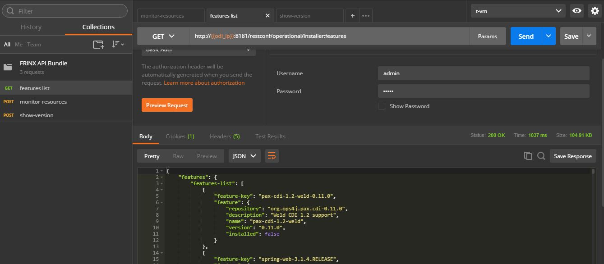
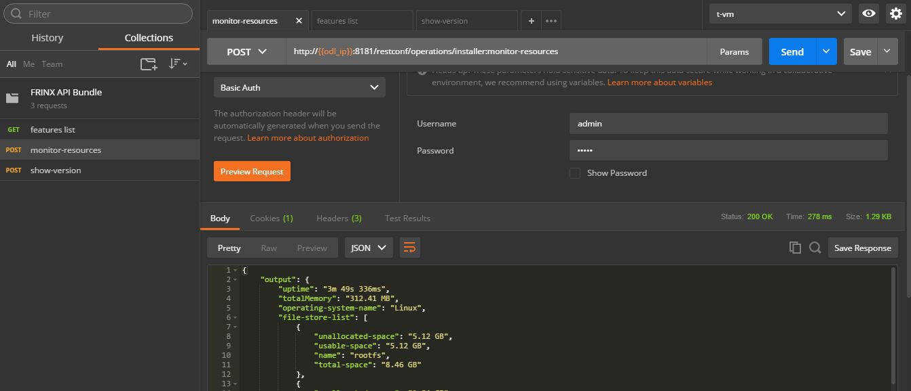

.. _using-the-frinx-api-bundle:

Using FRINX API Bundle
======================

FRINX ODL - Install features
----------------------------

To use this functionality, run the following command in the karaf console:

.. code-block:: guess

   feature:install frinx-installer-backend

The bundle comprises four REST services which can be implemented using either CURL or Postman REST calls:  

Import Postman collection
-------------------------

1. To download and use FRINX pre-configured Postman REST calls - see :doc`API`. 
2. Follow that guide to import the file ``postman_collection_FRINX API Bundle.json`` from the directory ``Infrastructure``.
3. Configure an environment in Postman :doc`API` where you set a value for ``odl_ip``.

Operations Guide
----------------

Feature list
~~~~~~~~~~~~

This allows a list of features to be extracted without starting up karaf. Each feature must have the following properties:

name - version - repository - description - installed (boolean value, whether it is installed or not)

You can run either:
With Postman REST call ``features list`` which is already set up as follows:  

* GET. (username: admin password: admin).  
* Issue the call by hitting **Send**.

.. code-block:: guess

   http://[host]:[port]/restconf/operational/installer:features

Example output:

* Or by typing the following in a terminal window:
  
.. code-block:: bash

     curl 'http://localhost:8181/restconf/operational/installer:features' -H 'Host: localhost:8181' -H 'Accept: application/json, text/plain, */*' -H 'Accept-Language: en-US,en;q=0.5' -H 'Authorization: Basic YWRtaW46YWRtaW4=' -X get

Whether using curl or Postman, output will be in the following format: (if using curl, the output can be passed through a JSON formatter to achieve the formatting below):  

.. code-block:: guess

   {  
      "features":{  
         "features-list":[  
            {  
               "feature-key":"odl-aaa-authz-0.3.2-Beryllium-SR2.3-frinxodl-SNAPSHOT",
               "feature":{  
                  "installed":false,
                  "name":"odl-aaa-authz",
                  "description":"OpenDaylight :: AAA :: Authorization",
                  "version":"0.3.2-Beryllium-SR2.3-frinxodl-SNAPSHOT",
                  "repository":"odl-aaa-0.3.2-Beryllium-SR2.3-frinxodl-SNAPSHOT"
               }
            },
            {  
               "feature-key":"odl-config-core-0.4.2-Beryllium-SR2.2-frinxodl",
               "feature":{  
                  "installed":false,
                  "name":"odl-config-core",
                  "description":"OpenDaylight :: Config :: Core",
                  "version":"0.4.2-Beryllium-SR2.2-frinxodl",
                  "repository":"odl-config-0.4.2-Beryllium-SR2.2-frinxodl"
               }
            },
            {  
               "feature-key":"config-3.0.3.11-frinxkaraf",
               "feature":{  
                  "installed":true,
                  "name":"config",
                  "description":"Provide OSGi ConfigAdmin support",
                  "version":"3.0.3.11-frinxkaraf",
                  "repository":"standard-3.0.3.11-frinxkaraf"
               }
            },
            {  
               "feature-key":"odl-openflowplugin-app-config-pusher-0.2.2-Beryllium-SR2.3-frinxodl-SNAPSHOT",
               "feature":{  
                  "installed":false,
                  "name":"odl-openflowplugin-app-config-pusher",
                  "description":"OpenDaylight :: Openflow Plugin :: app - default config-pusher",
                  "version":"0.2.2-Beryllium-SR2.3-frinxodl-SNAPSHOT",
                  "repository":"openflowplugin-0.2.2-Beryllium-SR2.3-frinxodl-SNAPSHOT"
               }
            },
            {  
               "feature-key":"odl-config-netty-config-api-0.4.2-Beryllium-SR2.2-frinxodl",
               "feature":{  
                  "installed":false,
                  "name":"odl-config-netty-config-api",
                  "description":"OpenDaylight :: Config :: Netty Config API",
                  "version":"0.4.2-Beryllium-SR2.2-frinxodl",
                  "repository":"odl-config-0.4.2-Beryllium-SR2.2-frinxodl"
               }
            },
            {  
               "feature-key":"odl-mdsal-all-1.3.2-Beryllium-SR2.3-frinxodl-SNAPSHOT",
               "feature":{  
                  "installed":false,
                  "name":"odl-mdsal-all",
                  "description":"OpenDaylight :: MDSAL :: All",
                  "version":"1.3.2-Beryllium-SR2.3-frinxodl-SNAPSHOT",
                  "repository":"odl-mdsal-1.3.2-Beryllium-SR2.3-frinxodl-SNAPSHOT"
               }
            },
            {  
               "feature-key":"odl-mdsal-clustering-1.3.2-Beryllium-SR2.2-frinxodl",
               "feature":{  
                  "installed":false,
                  "name":"odl-mdsal-clustering",
                  "description":"",
                  "version":"1.3.2-Beryllium-SR2.2-frinxodl",
                  "repository":"odl-mdsal-1.3.2-Beryllium-SR2.2-frinxodl"
               }
            }
         ]
      }
   }

Monitor resources
~~~~~~~~~~~~~~~~~

This displays base information about system, memory and disk management

You can run either:  

With Postman REST call ``monitor-resources`` which is already set up as follows:  

* POST. (username: admin password: admin).  
* Issue the call by hitting **Send**.

.. code-block:: guess

   http://[host]:[port]/restconf/operations/installer:monitor-resources

Example output:

* Or by typing the following in a terminal window:
  .. code-block:: bash

     curl 'http://localhost:8181/restconf/operations/installer:monitor-resources' -H 'Host: localhost:8181' -H 'Content-Type: application/json;charset=utf-8' -H 'Authorization: Basic YWRtaW46YWRtaW4=' -X post

In each case, output will be in the following format (if using curl, the output can be passed through a JSON formatter to achieve the formatting below):

.. code-block:: guess

   {  
      "output":{  
         "file-store-list":[  
            {  
               "unallocated-space":"2.58 GB",
               "name":"udev",
               "total-space":"2.58 GB",
               "usable-space":"2.58 GB"
            },
            {  
               "unallocated-space":"530.83 MB",
               "name":"tmpfs",
               "total-space":"531.88 MB",
               "usable-space":"530.83 MB"
            },
            {  
               "unallocated-space":"49.13 GB",
               "name":"/dev/sda1",
               "total-space":"104.05 GB",
               "usable-space":"43.82 GB"
            },
            {  
               "unallocated-space":"4.00 KB",
               "name":"none",
               "total-space":"4.00 KB",
               "usable-space":"4.00 KB"
            },
            {  
               "unallocated-space":"5.00 MB",
               "name":"none",
               "total-space":"5.00 MB",
               "usable-space":"5.00 MB"
            },
            {  
               "unallocated-space":"2.60 GB",
               "name":"none",
               "total-space":"2.60 GB",
               "usable-space":"2.60 GB"
            },
            {  
               "unallocated-space":"100.00 MB",
               "name":"none",
               "total-space":"100.00 MB",
               "usable-space":"100.00 MB"
            },
            {  
               "unallocated-space":"100.00 KB",
               "name":"cgmfs",
               "total-space":"100.00 KB",
               "usable-space":"100.00 KB"
            },
            {  
               "unallocated-space":"49.13 GB",
               "name":"/dev/sda1",
               "total-space":"104.05 GB",
               "usable-space":"43.82 GB"
            },
            {  
               "unallocated-space":"531.88 MB",
               "name":"tmpfs",
               "total-space":"531.88 MB",
               "usable-space":"531.88 MB"
            }
         ],
         "vm-vendor":"Oracle Corporation",
         "availableProcessors":2,
         "operating-system-name":"Linux",
         "uptime":"1days 45m 31s 285ms",
         "freeMemory":"422.21 MB",
         "maxMemory":"1.78 GB",
         "start-time":"2016-08-24 15:39:06.512",
         "totalMemory":"799.50 MB",
         "vm-version":"25.91-b14",
         "vm-name":"OpenJDK 64-Bit Server VM",
         "operating-system-version":"4.4.0-34-generic"
      }
   }

Upload a KAR file
~~~~~~~~~~~~~~~~~

This function allows the user to easily upload any KAR file to the Karaf distribution. Before installing, the KAR file is validated. There is an HTTP servlet which listens on

.. code-block:: guess

   http://[host]:[port]/kar-uploader

The POST request contains one parameter which indicates the binary data of the KAR file. The parameter should be specified in `base64 binary data format <https://tools.ietf.org/html/rfc6020#section-9.8.2>`__ (as in the example curl command below).

For example the CURL has a function to convert file location to binary data. You can upload a KAR file by typing the following in a terminal window:

.. code-block:: bash

       curl 'http://localhost:8181/restconf/operations/installer:upload-kar' -H 'Host: localhost:8181' -H 'Content-Type: application/yang.data+json;charset=utf-8' -H 'Authorization: Basic YWRtaW46YWRtaW4=' -X post -d '{"input":{"data":"'"$(base64 --wrap=0 upload/dummy-1.0.0.kar)"'"}}' -H 'Connection: keep-alive' -H "Expect:"

*where upload/dummy-1.0.0.kar is the path of the KAR file to be uploaded*

This will give the following output which confirms that the file has been uploaded correctly:

.. code-block:: guess

       {
          "output":{
             "outcome":"Data was successfully uploaded. Length of file is: 7456 bytes"
          }
       }

.. list-table::
   :header-rows: 1

   * - Feature Guide
     - 
     - 
   * - Feature introduced in
     - FRINX 1.2.6
     - API bundle module

