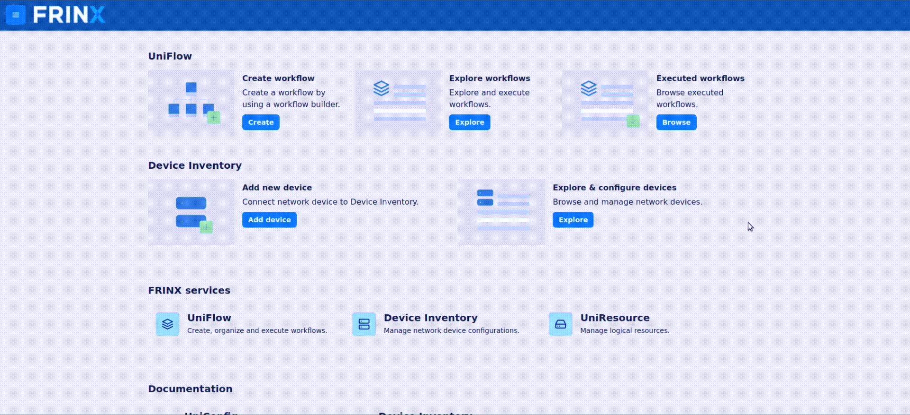
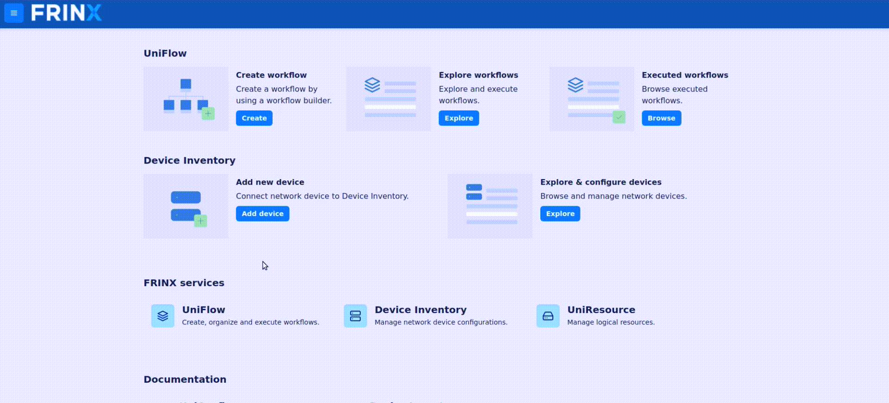

Device Blueprints
=================

Blueprints allow you to create a template that can be used for quick
adding of devices. They are created with JSON snippets.

Creating new blueprint
----------------------

To create a new blueprint click on the `Explore` button in the
`Explore and configure device` tab and then click the `Blueprints` tab
in the top bar. Here you can `Add blueprint`.

[](blueprints_create.gif)

Using a blueprint
-----------------

To use blueprint when adding a new device toggle the "Blueprints" switch
in the form and choose the blueprint that you want to use.

[](blueprints_use.gif)

Blueprint examples
------------------

### Cisco classic IOS (cli)

``` {.sourceCode .json}
{
    "cli":{
        "cli-topology:host":"192.168.1.25",
        "cli-topology:port":"22",
        "cli-topology:transport-type":"ssh",
        "cli-topology:device-type":"ios",
        "cli-topology:device-version":"15.4",
        "cli-topology:username":"USERNAME",
        "cli-topology:password":"PASSWORD",
        "cli-topology:journal-size":500,
        "cli-topology:dry-run-journal-size":180,
        "cli-topology:parsing-engine":"tree-parser"
    }
}
```

### Cisco IOS XR (netconf)

``` {.sourceCode .json}
{
    "netconf":{
        "netconf-node-topology:host":"10.0.0.1",
        "netconf-node-topology:port":830,
        "netconf-node-topology:keepalive-delay":5,
        "netconf-node-topology:tcp-only":false,
        "netconf-node-topology:username":"USERNAME",
        "netconf-node-topology:password":"PASSWORD",
        "netconf-node-topology:dry-run-journal-size":180,
        "uniconfig-config:uniconfig-native-enabled":true,
        "uniconfig-config:blacklist":{
            "uniconfig-config:path":[
                "openconfig-interfaces:interfaces",
                "ietf-interfaces:interfaces",
                "openconfig-vlan:vlans",
                "openconfig-routing-policy:routing-policy",
                "openconfig-lldp:lldp",
                "Cisco-IOS-XR-l2vpn-cfg:l2vpn",
                "Cisco-IOS-XR-group-cfg:groups",
                "openconfig-acl:acl",
                "openconfig-network-instance:network-instances"
            ]
        }
    }
}
```

### JUNOS (cli)

``` {.sourceCode .json}
{
    "cli":{
        "cli-topology:host":"10.103.5.208",
        "cli-topology:port":"22",
        "cli-topology:transport-type":"ssh",
        "cli-topology:device-type":"junos",
        "cli-topology:device-version":"17.3",
        "cli-topology:username":"USERNAME",
        "cli-topology:password":"PASSWORD",
        "cli-topology:journal-size":150,
        "uniconfig-config:install-uniconfig-node-enabled":false
    }
}
```

### CALIX (netconf)

``` {.sourceCode .json}
{
    "netconf":{
        "netconf-node-topology:host":"10.19.0.16",
        "netconf-node-topology:port":830,
        "netconf-node-topology:keepalive-delay":0,
        "netconf-node-topology:tcp-only":false,
        "netconf-node-topology:username":"USERNAME",
        "netconf-node-topology:password":"PASSWORD",
        "uniconfig-config:uniconfig-native-enabled":true,
        "uniconfig-config:install-uniconfig-node-enabled":true,
        "uniconfig-config:blacklist":{
            "uniconfig-config:path":[],
            "uniconfig-config:extension":[]
        }
    }
}
```

### Nokia (netconf)

``` {.sourceCode .json}
{
    "netconf":{
        "netconf-node-topology:host":"10.19.0.18",
        "netconf-node-topology:port":2830,
        "netconf-node-topology:keepalive-delay":10,
        "netconf-node-topology:tcp-only":false,
        "netconf-node-topology:username":"USERNAME",
        "netconf-node-topology:password":"PASSWORD",
        "uniconfig-config:uniconfig-native-enabled":true,
        "uniconfig-config:install-uniconfig-node-enabled":true,
        "uniconfig-config:blacklist":{
            "uniconfig-config:path":[]
        },
        "netconf-node-topology:yang-module-capabilities":{
            "capability":[
                "urn:ietf:params:xml:ns:yang:ietf-inet-types?module=ietf-inet-types&amp;revision=2010-09-24",
                "urn:ietf:params:xml:ns:netconf:base:1.0?module=ietf-netconf&amp;revision=2011-06-01"
            ]
        },
        "netconf-node-topology:customization-factory":"netconf-customization-alu"
    }
}
```

### Ciena (cli)

``` {.sourceCode .json}
{
    "cli":{
        "cli-topology:host":"localhost",
        "cli-topology:port":"51022",
        "cli-topology:transport-type":"ssh",
        "cli-topology:device-type":"saos",
        "cli-topology:device-version":"8",
        "cli-topology:username":"USERNAME",
        "cli-topology:password":"PASSWORD",
        "cli-topology:journal-size":150,
        "cli-topology:dry-run-journal-size":180,
        "cli-topology:keepalive-delay":45,
        "cli-topology:keepalive-timeout":45
    }
}
```
