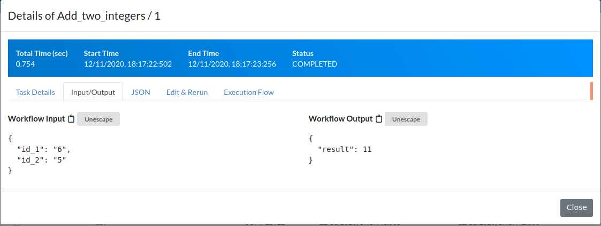

Create and Modify Workflows and Workers
=======================================

Prepare Your Work Environment
-----------------------------

After you have installed and started the FRINX Machine (see
"<https://github.com/FRINXio/FRINX-machine>") you will want to modify
existing workflows or add new workflows and workers to meet your needs.
We will be referring to the machine that is running the FRINX Machine
containers as host. Typically that host is a VM running on your laptop,
in your private cloud or in a public/virtual private cloud. Here is how
to get started.

Creating a worker
-----------------

Now that we have our environment prepared, we can move on to the first
step of creating a workflow. First we will create a worker that defines
the tasks utilized in our workflow. The goal is to have the task in our
workflow receive two input parameters (id\_1 and id\_2). The purpose of
our task is to add the two input variables and return the result. The
execution logic of our task will be implemented in a small python
function called worker.

For a full documentation of tasks, workflows and the capabilities of
Netflix Conductor, please go to
[<https://netflix.github.io/conductor/>](https://netflix.github.io/conductor/)

Create a worker in a correct repository (name of the worker is up to
you):

``` {.sourceCode .console}
~/FRINX-machine/fm-workflows/demo-workflows/workers$ touch add_integers_worker.py
```

This is what we put in the file in our case:

``` {.sourceCode .python}
from __future__ import print_function


def execute_add_two_integers(task):
  addend_one = task['inputData']['id_1']
  addend_two = task['inputData']['id_2']
  result = int(addend_one) + int(addend_two)
  return {'status': 'COMPLETED', 'output': {'result': result}, 'logs': []}

def start(cc):
  print('Starting add_two_integers worker')
  cc.register('add_two_integers', {
  "name": "add_two_integers",
      "retryCount": 0,
      "timeoutSeconds": 30,
      "inputKeys": [
          "id_1",
          "id_2"
      ],
      "timeoutPolicy": "TIME_OUT_WF",
      "retryLogic": "FIXED",
      "retryDelaySeconds": 0,
      "responseTimeoutSeconds": 30
      }
  )
  cc.start('add_two_integers', execute_add_two_integers, False)
```

Core of the worker is a task that contains simple method which does
addition with two inputs which user provides in GUI as you will see
later. Workers can have multiple tasks within itself, in our case one is
enough as an example.

After this, you must register your worker in the main python file
"main.py" in the same directory where you just created your worker. All
workers you want to use in Frinx Machine must be included in this file.
File might look similar to this:

``` {.sourceCode .python}
```

> emphasize-lines
> :   22,53
>
> > import time import worker\_wrapper from frinx\_rest import
> > conductor\_url\_base import inventory\_worker import lldp\_worker
> > import platform\_worker import vll\_worker import unified\_worker
> > import vll\_service\_worker import vpls\_worker import
> > vpls\_service\_worker import bi\_service\_worker import
> > common\_worker import psql\_worker from import\_workflows import
> > import\_workflows import cli\_worker import netconf\_worker import
> > uniconfig\_worker import http\_worker from importDevices import
> > import\_devices import os import add\_integers\_worker
> >
> > workflows\_folder\_path = '../workflows' healtchchek\_file\_path =
> > '../healthcheck'
> >
> > def main():
> > :   if os.path.exists(healtchchek\_file\_path):
> >     :   os.remove(healtchchek\_file\_path)
> >
> >     print('Starting FRINX workers') cc =
> >     worker\_wrapper.ExceptionHandlingConductorWrapper(conductor\_url\_base,
> >     1, 1) register\_workers(cc)
> >     import\_workflows(workflows\_folder\_path)
> >     import\_devices("../devices/cli\_device\_data.csv",
> >     "../devices/cli\_device\_import.json")
> >     import\_devices("../devices/netconf\_device\_data.csv",
> >     "../devices/netconf\_device\_import.json")
> >
> >     with open(healtchchek\_file\_path, 'w'): pass
> >
> >     \# block while 1: time.sleep(1000)
> >
> > def register\_workers(cc):
> > :   platform\_worker.start(cc) lldp\_worker.start(cc)
> >     inventory\_worker.start(cc) unified\_worker.start(cc)
> >     psql\_worker.start(cc) add\_integers\_worker.start(cc) \#
> >     vll\_worker.start(cc) \# vll\_service\_worker.start(cc) \#
> >     vpls\_worker.start(cc) \# vpls\_service\_worker.start(cc) \#
> >     bi\_service\_worker.start(cc)
> >
> > if \_\_name\_\_ == '\_\_main\_\_':
> > :   main()
> >
As you see in highlighted lines, you must both import the worker file
and include it in "register\_workers(cc)" method.

That is all in terms of worker creation. There is however few more
things to do in your environment. After doing all the above, we will
want to build our Frinx Machine based on our local changes. For that we
must edit the file "swarm-fm-workflow.yml"

``` {.sourceCode .console}
~/FRINX-machine/fm-workflows/composefiles$ ls

swarm-fm-workflows.yml
```

Find block "demo-workflows" in this file. Change the image to use a
image called "local"

``` {.sourceCode .json}
demo-workflows:
 image: frinx/demo-workflows:local
 logging:
   driver: "json-file"
   options:
     max-file: "3"
     max-size: "10m"
 environment:
   - UNICONFIG_URL_BASE=https://${CONSTRAINT_HOSTNAME}_uniconfig:8181/rests
 healthcheck:
   test: cat /home/app/healthcheck
   interval: 10s
   timeout: 5s
   retries: 5
   start_period: 10s
 deploy:
   # placement:
   #   constraints:
   #     - node.hostname == ${CONSTRAINT_HOSTNAME}
   mode: replicated
   replicas: 1
```

Now we can build our fm-workflows image with the added task. Use:

``` {.sourceCode .console}
```

> emphasize-lines
> :   2
>
> > \~/FRINX-machine/fm-workflows\$ docker build --no-cache -f
> > demo-workflows/Dockerfile -t frinx/demo-workflows:local
> > ./demo-workflows/

> **important**
>
> While it is not necessary to use "--no-cache" flag, we recommend it to
> make sure you rebuild the image with newly edited code and not the one
> stored in cache memory.

Now just start fm-workflows and you're good to go:

``` {.sourceCode .console}
~/FRINX-machine/fm-workflows$ 
./startup.sh
```

If you did everything correctly, you will now see your new task in Frinx
Machine. Go to UniFlow --\> Tasks --\> Search:

[](fm_search_integers_task.png)

Now you can create workflow that uses this task. UniFlow --\> + New:

<iframe width="1120" height="630" src="https://www.youtube.com/embed/dB_yR1GhBGU" frameborder="0" allow="accelerometer; autoplay; clipboard-write; encrypted-media; gyroscope; picture-in-picture" allowfullscreen></iframe>
### After being prompted for inputs, you should see that addition ran successfully:

[](successful_workflow_addition.png)

``` {.sourceCode .json}
```

> emphasize-lines
> :   3,5,6,28,75
>
> {
> :   "taskType": "add\_two\_integers", "status": "COMPLETED",
>     "inputData": { "id\_1": "6", "id\_2": "5" }, "referenceTaskName":
>     "add\_two\_integers\_ref\_XCFR", "retryCount": 0, "seq": 1,
>     "pollCount": 1, "taskDefName": "add\_two\_integers",
>     "scheduledTime": 1607707042557, "startTime": 1607707043195,
>     "endTime": 1607707043237, "updateTime": 1607707043196,
>     "startDelayInSeconds": 0, "retried": false, "executed": true,
>     "callbackFromWorker": true, "responseTimeoutSeconds": 30,
>     "workflowInstanceId": "1fcf782c-1cd6-4219-a6eb-e9d218de8b80",
>     "workflowType": "Add\_two\_integers", "taskId":
>     "9b88a65e-9869-420c-bd05-d42963948a39", "callbackAfterSeconds": 0,
>     "workerId": "b5592d30c747", "outputData": { "result": 11 },
>     "workflowTask": { "name": "add\_two\_integers",
>     "taskReferenceName": "add\_two\_integers\_ref\_XCFR",
>     "inputParameters": { "id\_1": "\${workflow.input.id\_1}", "id\_2":
>     "\${workflow.input.id\_2}" }, "type": "SIMPLE", "decisionCases":
>     {}, "defaultCase": [], "forkTasks": [], "startDelay": 0, "joinOn":
>     [], "optional": false, "taskDefinition": { "createTime":
>     1607703392256, "createdBy": "", "name": "add\_two\_integers",
>     "retryCount": 0, "timeoutSeconds": 30, "inputKeys": [ "id\_1",
>     "id\_2" ], "outputKeys": [], "timeoutPolicy": "TIME\_OUT\_WF",
>     "retryLogic": "FIXED", "retryDelaySeconds": 0,
>     "responseTimeoutSeconds": 30, "inputTemplate": {},
>     "rateLimitPerFrequency": 0, "rateLimitFrequencyInSeconds": 1 },
>     "defaultExclusiveJoinTask": [], "asyncComplete": false,
>     "loopOver": [] }, "rateLimitPerFrequency": 0,
>     "rateLimitFrequencyInSeconds": 1, "workflowPriority": 0,
>     "iteration": 0, "taskDefinition": { "present": true },
>     "loopOverTask": false, "taskStatus": "COMPLETED", "queueWaitTime":
>     638, "logs": []
>
> }
