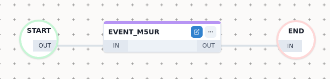
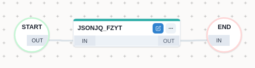
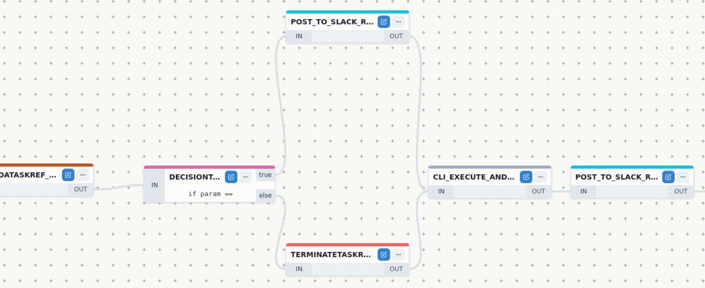

  ------------------------------------------------------------------------------------------------------------------------------------------------------------------------------
  Workflow Builder is the graphical interface of UniFlow used to create, modify and manage workflows.
  Creating new workflow
  ---------------------
  To create a new workflow click on the `Create` button in the `Create workflow` tab and
  fill in workflow general parameters. Then you can proceed with adding tasks \<workflow-builder-adding-tasks\>.
  .. note::
  Parameter `Name` is required and must be unique. Keep in mind that the name cannot be changed later.
  Other parameters are optional and can be changed anytime.
  .. image:: createnew.gif
  :target: /\_images/createnew.gif
  :alt: alt\_text
  Editing existing workflow
  -------------------------
  To edit an already existing workflow, find the workflow in the `Definitions` tab, click on it and then click on the `Edit` button.
  A diagram of the workflow will be rendered on the canvas. Now you can restructure the workflow, add new tasks, remove tasks or edit the workflow information and parameters.
  .. image:: edit.gif
  :target: /\_images/edit.gif
  :alt: alt\_text
  Adding tasks
  -------------
  To add new task on canvas, find the task in the left menu and click the `+` icon.
  .. image:: add\_task.gif
  :target: /\_images/add\_task.gif
  :alt: alt\_text
  .. \_workflow-builder-adding-tasks:
  Removing tasks
  --------------
  To remove a task, click on the three dots next to a task and press the `Remove task` button.
  .. image:: delete.gif
  :target: /\_images/delete.gif
  :alt: alt\_text
  Task parameters
  """""""""""""""
  To edit or add task parameters, double-click on the task that is placed on the canvas.
  Input parameters can be declared as:
  - Input provided by user, e.g.:
  `${workflow.input.<name>}`
  - Variable provided by other task, e.g.:
  `${<taskRefName>.output.result}`
  - Statically defined, e.g.:
  `https://example.com/api/user`
  For full documentation of tasks see: <https://netflix.github.io/conductor/configuration/taskdef/>.
  System tasks
  ------------
  Fork & Join
  """""""""""""""
  The 'Fork' function is used to schedule a parallel set of tasks.
  .. note::
  A **Join** task MUST follow **Fork** task.
  .. image:: forkjoin.png
  :target: forkjoin.png
  :alt: alt\_text
  Decision
  """"""""
  A decision task is similar to an **if...else** statement in a programming language. The task takes 2 parameters:
  - name of the parameter in the task input whose value will be evaluated (default is `param`)
  - value that will be compared with `param` (or other specified input variable)
  If `param` and `is equal to` are evaluated as equal, the workflow will continue to `If` branch,
  otherwise the workflow will continue in `else` branch.
  .. note::
  **Else** branch is optional and can be empty.
  .. image:: decide.png
  :target: decide.png
  :alt: alt\_text
  .. \_workflow-builder-lambda-task:
  Lambda
  """"""
  Lambda Task helps execute ad hoc logic at Workflow run-time, using javax & `Nashorn` Javascript evaluator engine.
  This is particularly helpful in running simple evaluations in the Conductor server, instead of creating Workers.
  .. image:: lambda.png
  :target: lambda.png
  :alt: alt\_text
  .. code-block:: javascript
  if (\$.lambdaValue == 1) {
  return {testvalue: true}
  } else {
  return {testvalue: false}
  }
  The task output can then be referenced in downstream tasks like: `${lambda_a211.output.result.testvalue}`
  HTTP
  """"
  An HTTP system task is used to make calls to another microservice over HTTP.
  You can use `GET`, `PUT`, `POST`, `DELETE` Methods and also you can set your custom header.
  .. image:: http.png
  :target: http.png
  :alt: alt\_text
  TERMINATE
  """""""""
  Task that can terminate a workflow with a given status and modify the workflow's output with a given parameter.
  It can act as a "return" statement for conditions where you simply want to terminate your workflow.
  For example, if you have a decision where the first condition is met, you want to execute some tasks, otherwise you want to finish your workflow.
  ================= ======================================= =======================
  name description notes
  ================= ======================================= =======================
  terminationStatus can only accept "COMPLETED" or "FAILED" task cannot be optional
  workflowOutput Expected workflow output
  ------------------------------------------------------------------------------------------------------------------------------------------------------------------------------

[](terminate.png)

EVENT
=====

Event task provides ability to publish an event (message) to either
Conductor or an external eventing system like SQS. Event tasks are
useful for creating event based dependencies for workflows and tasks.

[](event.png)

When producing an event with Conductor as sink, the event name follows
the structure: `conductor:<workflow_name>:<task_reference_name>`

WAIT
====

A wait task is implemented as a gate that remains in `IN_PROGRESS` state
unless marked as `COMPLETED` or `FAILED` by an external trigger. To use
a wait task, set the task type as `WAIT`

[](wait.png)

jsonJQ
======

jsonJQ is like sed for JSON data - it is especially useful for filtering
JSON data.

[](jsonjq.png)

Example of jsonJQ query expression could be:

``` {.sourceCode .guess}
.["frinx-uniconfig-topology:configuration"]["Cisco-IOS-XR-ifmgr-cfg:interface-configurations"] . "interface-configuration" | select(. != null) | .[] | select(.description == "${workflow.input.Description}") | {interface: ."interface-name"}
```

It searches through the whole config and under the
"Cisco-IOS-XR-ifmgr-cfg:interface-configurations" model we find the
interface with a description that the user inputs
(\${workflow.input.Description}). The task would return the name
interface with fitting description.

Kafka publish
=============

Kafka is a distributed publish-subscribe messaging system and a robust
queue that can handle a high volume of data and enables you to pass
messages from one end-point to another.

[](kafka.png)

Subworkflows
------------

Subworkflows act as a regular tasks inside a parent workflow.
Subworkflows can be expanded to view the tasks they contain (or other
nested subworkflows) by clicking the three dots next to the subworkflow
and then clicking the `Expand` button. Expanded subworkflows can be then
edited the same way as parent workflow.

> **note**
>
> **Simple tasks** differs in color shade from **Subworkflow** tasks and
> cannot be expanded.

[](expand.gif)

Linking tasks
-------------

To connect tasks or subworkflows into execution flow, drag and drop
respective **Out** and **In** endpoints on nodes, like this: **Out**
---\> **In**

[](linking.gif)

Unlinking tasks -------------

To remove the link, double-click on the link.

[](unlinking.gif)

Adding workflow information --------------------------

To provide additional workflow information, click on `Actions` in the
upper right-hand corner and then click `Edit workflow`.

Output parameters
=================

We can specify custom output parameters of a workflow, by using JSON
templates to generate the output of the workflow. If not specified, the
output is defined as the output of the last executed task.

Let's say we have a task with taskReferenceName: `task1` which returns
`summary` and we want output of the worklow to be output of this
specific task only. The outputParameter value named e.g. `finalResult`
will be: `${task1.output.summary}`

For full documentation of workflow parameters and definition read
<https://netflix.github.io/conductor/configuration/workflowdef/>.

Defaults & Description
======================

Here, we can define default values and descriptions for workflow inputs.
Each input value declared as `${workflow.input...}` will appear in a
dropdown list of available input parameters.

Save and execute workflow
-------------------------

To **Save** workflow, click on the `Actions` button in the upper right
corner and select `Save workflow`. Then you can find the workflow in the
`Explore workflows` section under `Definitions` tab.

To **Execute** workflow directly from the builder, click on the
`Save and execute` button in the upper right corner. You will be
prompted to provide input parameters.

> **note**
>
> **Executing** workflow will also save the workflow.

Import and export of workflows
------------------------------

To import workflow, click the setting icon and then select the `Import`
button. Only **valid** JSON definition of the workflow will be imported.

> **note**
>
> Imported workflow will not be saved until you **Save** or **Execute**
> it.

[](import_export.gif)

To export and save the workflow in JSON format into your filesystem,
click on `Export` button.

> **note**
>
> In order to choose a location to which you want to export the
> workflow, you have to have it enabled in your browser settings.
> Default location is Downloads folder.
